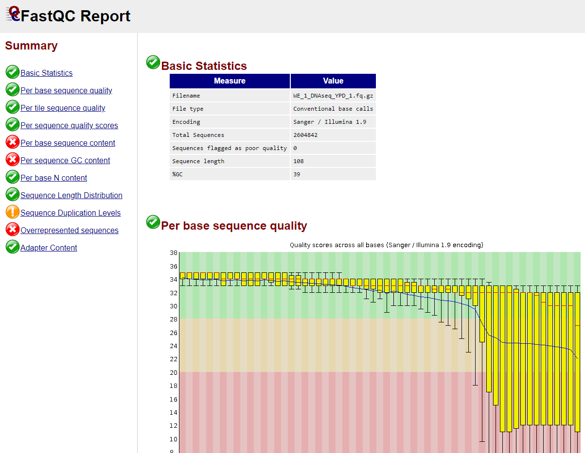
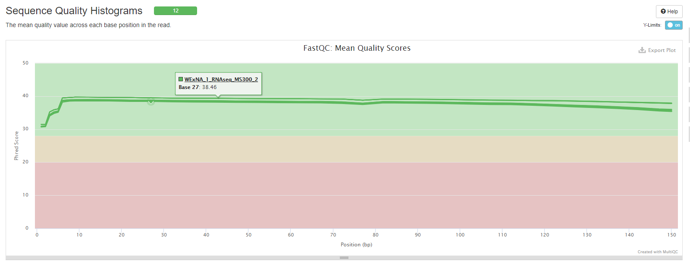

## El formato fastq

Todas las reads que obtuvimos de los distintos ensayos tienen una extension tipo fastq (*.fq o *.fastq), que en la práctica son simplemente archivos de texto con la secuencias nucleotidicas y la calidad de la secuenciación de estas. 
En nuestro caso, las reads estan comprimidas, por lo tanto además tienen la extension .gz 
Podemos mirar las primeras lineas de estos archivos fastq primero descomprimiendo (usando gzip) y luego usando el comando "head" que imprimirá solo las primeras lineas en pantalla (estos archivos generalmente tienen miles de lineas!)

~~~
gzip -k -d DNAseq/WE_1_DNAseq_YPD_1.fq.gz
head -n 4 DNAseq/WE_1_DNAseq_YPD_1.fq
~~~
{: .language-bash}

~~~

@IL29_4505:7:1:1072:8738#5/1
TTGCCTTTTTTTGTTGACAATAAATTCCCTTCTGAAGCCACCGGGGACATCTACACCACTTGCTGATGACACTTTAGTATGGTGCTCACTTTCAGGTGTTACATTCTC
+
BABABBAAAABBBBBB:BBAB>,>BBBBBBBB>>86A?A=BBBBAB-B??,7237BB:BBB:A>@.=?.A7,743?),940527?B>@=B<A+A6;>B>><B?;>+,?

~~~
{: ..output}

Entonces head -n 4 nos muestra las primeras cuatro lineas del archivo WE_1_DNAseq_YPD_1.fq. Estas primeras cuatro lineas corresponden a la información completa de la primera read (si hacen head -n 8 verán la información de las primeras dos reads)
La primera linea es el nombre que se le asigna a la read (que comienza con una @), donde por ejemplo se indica el modelo del secuenciador (IL29_4505), y al final a cual de los dos pares corresponde (/1) (en caso de reads pareadas)  
~~~

@IL29_4505:7:1:1072:8738#5/1

~~~
{: ..output}

En la segunda linea esta la secuencia nucleotidica obtenida

~~~

TTGCCTTTTTTTGTTGACAATAAATTCCCTTCTGAAGCCACCGGGGACATCTACACCACTTGCTGATGACACTTTAGTATGGTGCTCACTTTCAGGTGTTACATTCTC

~~~
{: ..output}

En la cuarta linea esta la calidad de la secuenciacion para cada base de la secuencia obteniva

~~~

BABABBAAAABBBBBB:BBAB>,>BBBBBBBB>>86A?A=BBBBAB-B??,7237BB:BBB:A>@.=?.A7,743?),940527?B>@=B<A+A6;>B>><B?;>+,?

~~~
{: ..output}

Cada letra,número, o simbolo representa un valor de calidad de 1 a 40:

~~~

Quality encoding: !"#$%&'()*+,-./0123456789:;<=>?@ABCDEFGHI
                  |         |         |         |         |
Quality score:    0........10........20........30........40 

~~~
{: ..output}

Estos valores (Phred score) representan para cada base nucleotidica la probabilidad de que hayan sido designadas correctamente. Este valor es en base logaritmica, por lo tanto un valor Phred de 10 refiere a una confianza del 90% de que la base haya sido asignada correctamente.   

~~~

PhredQuality Score	Probability of incorrect base call					Base call accuracy
10						1 in 10							90%
20						1 in 100						99%
30						1 in 1000						99.9%
40						1 in 10,000						99.99%

~~~
{: ..output}

## FASTQC

El programa FASTQC nos ayudará visualizar el phred score de cada base secuenciada de todas nuestras reads, además de otros parametros.

Primero analizaremos el archivo WE_1_DNAseq_YPD_1.fq.gz (notar que no es necesario descomprimir el archivo para que lo ocupe FASTQC)

~~~
fastqc DNAseq/WE_1_DNAseq_YPD_1.fq.gz
~~~
{: .language-bash}

FASTQC genera un informe en formato HTML (más un archivo zip) del análisis de este archivo de secuencia (por defecto deja los informes en la carpeta del archivo analizado). Podemos abrir este informe usando un explorador web.

Para mayor información sobre el informe de FASTQC pueden visitar el siguiente link:
https://hbctraining.github.io/Intro-to-rnaseq-hpc-salmon/lessons/qc_fastqc_assessment.html

Ahora ejecutemos FASTQC para todos nuestros archivos. Para que FASTQC trabaje más rápido, podemos aumentar el número de CPUs que utilizará con la opción -t (el máximo depende del computador que estemos usando, pueden revisar el número de CPUs que tiene con el comando "htop")

Primero crearemos carpetas donde guardaremos los informes de estas reads crudas (raw)
~~~
mkdir DNAseq/fastqc_raw
mkdir RNAseq/fastqc_raw
mkdir ATACseq/fastqc_raw
~~~
{: .language-bash}

~~~
fastqc -t 8 -o DNAseq/fastqc_raw DNAseq/*.fq.gz
fastqc -t 8 -o ATACseq/fastqc_raw ATACseq/*.fq.gz
fastqc -t 8 -o RNAseq/fastqc_raw RNAseq/*.fq.gz
~~~
{: .language-bash}

En total se generaron 16 archivos HTML, y no es muy conveniente revisarlos uno a uno. El programa MULTIQC nos ayudará a generar un informe de los informes de FASTQC (Este programa también sirve para compilar otros tipos de informes de una variedad aplicaciones bioinformaticas)

~~~
multiqc -o DNAseq DNAseq/fastqc_raw
multiqc -o ATACseq ATACseq/fastqc_raw
multiqc -o RNAseq RNAseq/fastqc_raw
~~~
{: .language-bash}

El output de multiqc es también un archivo HTML (que especificamos que se guardara en la carpeta que analizamos). Gracias a multiqc podemos revisar los 12 archivos de secuenciación de RNAseq en el mismo gráfico: 

Ahora sabemos que nuestras reads de RNAseq y ATACseq en general tienen buena calidad, sin embargo las reads de DNAseq presentan varios problemas (baja calidad en el extremo 3', presencia de adaptadores)

## Procesamiento de reads con FASTP

Para arreglar nuestras reads, por ejemplo cortando los segmentos de baja calidad y eliminando adaptadores, utilizaremos el programa FASTP
Algo muy importante de FASTP es que acepta como input archivos de reads pareadas, por lo que si un miembro del par de las reads tiene mala calidad, fastp podrá eliminar ambas reads (que estan seperadas en archivos _1 y _2)
El siguiente comando limpiará las reads de DNAseq:
~~~
fastp --in1 DNAseq/WE_1_DNAseq_YPD_1.fq.gz --in2 DNAseq/WE_1_DNAseq_YPD_2.fq.gz --out1 DNAseq/cleaned_WE_1_DNAseq_YPD_1.fq.gz --out2 DNAseq/cleaned_WE_1_DNAseq_YPD_2.fq.gz -3 -l 40 -t 8 
~~~
{: .language-bash}

El parametro -3 sirve para cortar las bases desde el extremo 3' que tengan un phred menor a 20
El parametro -l 40 sirve para filtrar reads que tengan un tamaño menor a 40 bp (que pueden existir luego de cortarlas con el parametro -3)
El parametro -t 8 indica que usaremos 8 CPUs 

Noten que generamos nuevos archivos de reads (con el nombre "cleaned_" al principio).
Podemos luego verificar la limpieza de reads corriendo nuevamente FASTQC en los archivos "cleaned_".

Para continuar con los siguientes modulos, es necesario limpiar todas las reads (usando los mismos parametros que usamos para las reads de DNAseq), y revisar con FASTQC (en conjunto con MULTIQC) la calidad de las reads limpiadas


