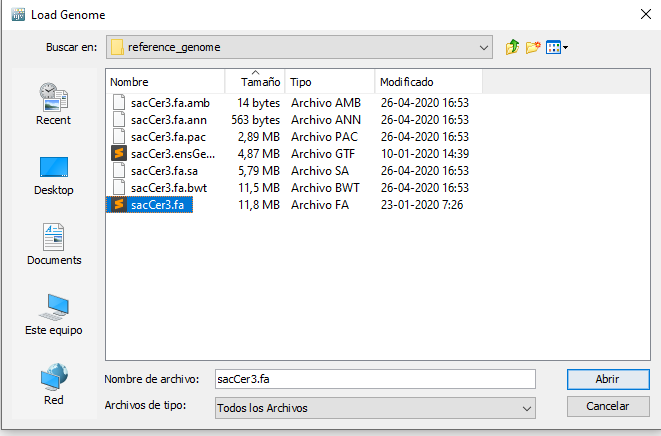
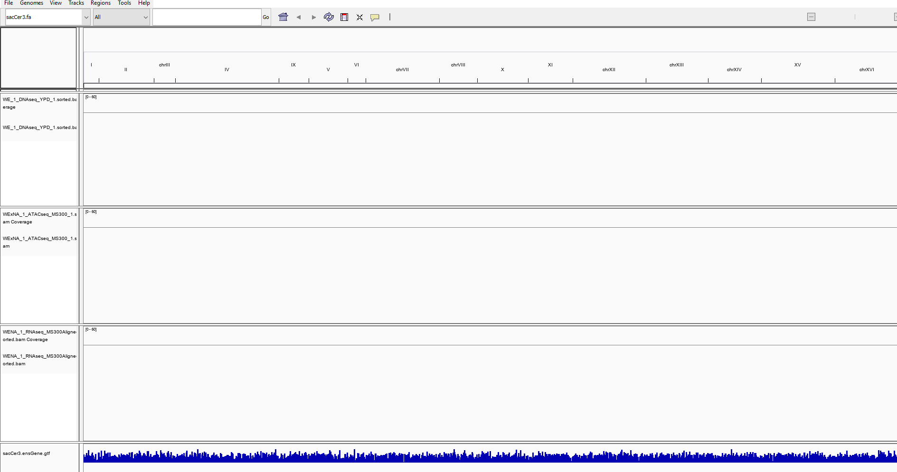
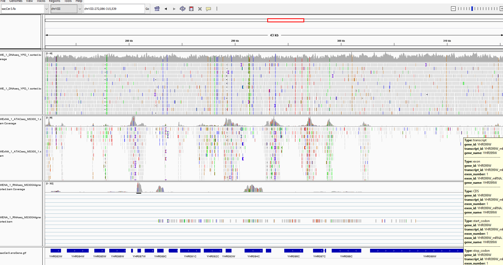

## Visualización de mapeos con IGV
IGV nos permite visualizar los archivos bam (que hayan sido ordenados con sorted e indexados con index)
Primero debemos cargar el genoma usando Genomes .. Load Genome from File.
Ahi tendremos que cargar el archivo Saccer.fa que esta en la carpeta reference_genome/

Ahora que tenemos el genoma cargado, podemos abrir los archivos .sorted.bam (no los .bai!). También para visualizar la posición de los genes anotados en el genoma, abriremos el archivo .GFT que esta en la carpeta referece_genome
Para una rápida comparación de los tres tipos de ensayos que tenemos, cargamos un archivo sorted.bam de DNAseq, ATACseq, y un archivo de RNAseq:

Para visualizar los mapeos tendremos que acercarnos a una región del genoma

Como pueden ver, los mapeos de reads caen en distintos lugares dependiendo de nuestros ensayos. Mapeos de DNAseq cubren en general todo el genoma, los de ATACseq se concentran en las regiones promotoras, y RNAseq se concentran en las regiones codificantes.
También podemos visualizar las variantes que corresponden a las diferencias de nuestras cepas con el genoma de referencia que proviene de la cepa de laboratorio S288C

## Analisis de calidad con QUALIMAP

Instalaremos qualimap usando conda

~~~
conda install -c bioconda qualimap
~~~
{: .language-bash}  

Generaremos informes HTML de cada archivo de mapeo (sorted.bam) con el siguiente script:
~~~
for FILE in bam/sorted_bam/*.sorted.bam;do qualimap bamqc -bam $FILE;done
~~~
{: .language-bash}  

También usaremos el modulo rnaseq de qualimap para un analisis más detallado de los mapeos de RNAseq

~~~
for FILE in bam/sorted_bam/*RNAseq*.sorted.bam;do qualimap rnaseq -bam $FILE -gtf reference_genome/sacCer3.ensGene.gtf;done
~~~
{: .language-bash}  

Podemos realizar nuevamente un informe conjunto con MULTIQC

~~~
multiqc -o bam/sorted_bam/ bam/sorted_bam/
~~~
{: .language-bash}  


